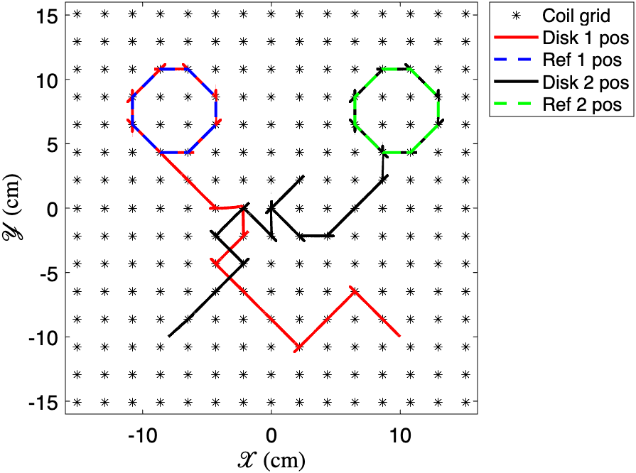

# MagTile Simulations with RRT Algorithm for Obstacle Avoidance

Here, to showcase the versatility of MagTile to different path planning, and obstacle avoidance frameworks, we repeat the simulations from the same initial conditions and following the same reference trajectories as those showcase in Figure 4 in the paper. Instead of using Dijkstra, we instead implement RRT as an obstacle avoidance mechanism. 

In the figures below we showcase how each agent tracks their corresponding reference. We also show case the position, velocity, and error for each agent against time in both the x and y directions along the grid.

\\

\\

